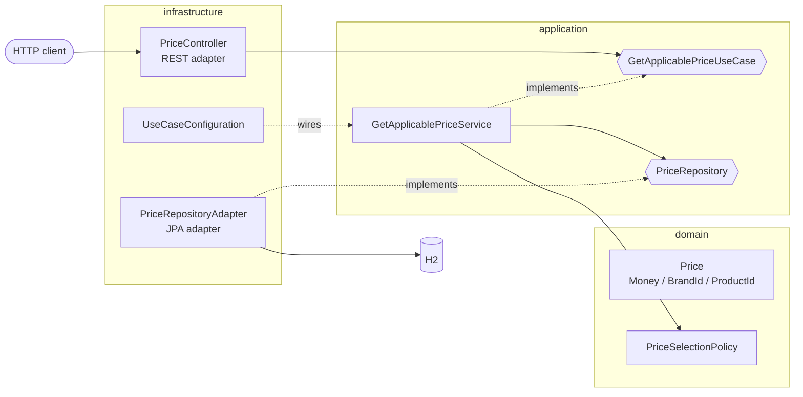

# Prices API

A Spring Boot REST service that returns the price that applies to a product of a brand at a given date.

Several price lists can overlap in time. When more than one applies, the one with the highest `priority` wins. The service loads the sample dataset into an in-memory H2 database and exposes a single query endpoint.

## Contents

- [Tech stack](#tech-stack)
- [Quick start](#quick-start)
- [API](#api)
- [Architecture](#architecture)
- [Price selection algorithm](#price-selection-algorithm)
- [Data model](#data-model)
- [Testing](#testing)
- [Design decisions and trade-offs](#design-decisions-and-trade-offs)
- [Possible improvements](#possible-improvements)
- [AI-assisted development](#ai-assisted-development)
- [Commit convention](#commit-convention)

## Tech stack

| Concern    | Choice                                                   |
|------------|----------------------------------------------------------|
| Language   | Java 21 (records, `var`, text blocks)                    |
| Framework  | Spring Boot 3.5 (Web, Validation, Data JPA)              |
| Database   | H2 in-memory, initialised from SQL scripts               |
| API docs   | springdoc-openapi (Swagger UI)                           |
| Errors     | RFC 9457 Problem Details                                 |
| Testing    | JUnit 5, AssertJ, Mockito, MockMvc, ArchUnit             |
| Build / CI | Maven (with wrapper), GitHub Actions                     |

## Quick start

**Requirements:** JDK 21 or later. You don't need Maven installed: the repository includes the Maven wrapper.

```bash
# Build and run every test
./mvnw verify

# Start the application on http://localhost:8080
./mvnw spring-boot:run

# Same, with the dev profile (enables the H2 console)
./mvnw spring-boot:run -Dspring-boot.run.profiles=dev
```

On Windows, use `mvnw.cmd` instead of `./mvnw`.

Query the endpoint:

```bash
curl "http://localhost:8080/api/v1/prices?applicationDate=2020-06-14T16:00:00&productId=35455&brandId=1"
```

```json
{
  "productId": 35455,
  "brandId": 1,
  "priceList": 2,
  "startDate": "2020-06-14T15:00:00",
  "endDate": "2020-06-14T18:30:00",
  "price": 25.45,
  "currency": "EUR"
}
```

[`requests.http`](requests.http) contains the five required scenarios and the error cases, ready to run from the IntelliJ HTTP client.

Other URLs while the application is running:

| URL                                     | What it is                                                              |
|-----------------------------------------|-------------------------------------------------------------------------|
| http://localhost:8080/swagger-ui.html   | Swagger UI to try the endpoint from the browser                         |
| http://localhost:8080/v3/api-docs       | OpenAPI specification (JSON)                                            |
| http://localhost:8080/h2-console        | H2 console, `dev` profile only (JDBC URL `jdbc:h2:mem:pricesdb`, user `sa`, empty password) |

## API

### `GET /api/v1/prices`

Returns the price of a product for a brand at the given date.

| Query parameter   | Type                                  | Required | Example               |
|-------------------|---------------------------------------|----------|-----------------------|
| `applicationDate` | ISO-8601 local date-time              | yes      | `2020-06-14T10:00:00` |
| `productId`       | positive integer                      | yes      | `35455`               |
| `brandId`         | positive integer                      | yes      | `1`                   |

| Status | Meaning                                                                                     |
|--------|---------------------------------------------------------------------------------------------|
| `200`  | Applicable price found (body shown in [Quick start](#quick-start))                          |
| `400`  | Missing, malformed or non-positive parameter, returned as `application/problem+json`        |
| `404`  | No price applies to that product and brand at that date, returned as `application/problem+json` |

Example error response:

```json
{
  "type": "about:blank",
  "title": "Price not found",
  "status": 404,
  "detail": "No applicable price found for brandId=1, productId=35455 at 2019-01-01T00:00",
  "instance": "/api/v1/prices"
}
```

## Architecture

The code follows **hexagonal architecture (ports and adapters)** with three layers. Dependencies only point inwards: infrastructure → application → domain.



```
src/main/java/dev/alexmunoz/prices
├── domain                       # Pure Java: no framework dependencies
│   ├── model                    # Price (aggregate); Money, BrandId, ProductId (value objects)
│   ├── service                  # PriceSelectionPolicy (business rule)
│   └── exception                # PriceNotFoundException
├── application                  # Pure Java: orchestrates the domain
│   ├── port/in                  # GetApplicablePriceUseCase + GetApplicablePriceQuery (inbound port)
│   ├── port/out                 # PriceRepository (outbound port)
│   └── service                  # GetApplicablePriceService (use case implementation)
└── infrastructure               # Spring-dependent adapters
    ├── adapter/in/rest          # Controller, response DTO + mapper, error handling
    ├── adapter/out/persistence  # JPA entity, Spring Data repository, adapter + mapper
    └── config                   # Bean wiring for the domain and application classes
```

Key points:

- **Framework-free core.** The domain and application layers have no Spring or JPA annotations. `UseCaseConfiguration` in the infrastructure layer registers them as beans.
- **Ports owned by the application.** The inbound port (`port/in`) is the use case the outside world calls. The outbound port (`port/out`) is the contract the application needs from persistence. Both live in `application`, and the adapters in `infrastructure` implement or call them.
- **Typed identifiers.** `BrandId` and `ProductId` are value objects, so a brand id can't be passed where a product id is expected. Their positivity invariant lives in the domain.
- **Separate models per layer.** The JPA entity, the domain `Price` and the REST `PriceResponse` are different classes. `PriceEntityMapper` and `PriceResponseMapper` convert between them, so no layer leaks into another.
- **Boundaries enforced by tests.** `HexagonalArchitectureTest` (ArchUnit) fails the build if a dependency breaks the architecture.
- **Package-private adapters.** The controller, the JPA adapter, the Spring Data repository and the mappers are package-private. Other packages can only reach them through the ports.

## Price selection algorithm

The rule lives in `PriceSelectionPolicy` and uses the Streams API:

```java
return candidates.stream()
        .filter(Objects::nonNull)
        .filter(price -> price.isApplicableAt(applicationDate))
        .max(comparingInt(Price::priority)
                .thenComparing(Price::startDate)
                .thenComparingInt(Price::priceList));
```

1. Only prices whose validity period contains the application date are kept. **Both bounds are inclusive.**
2. The highest `priority` wins.
3. The specification doesn't cover ties on priority. In that case the price that started most recently wins, then the higher price list. That way the result never depends on the order the rows come back in.

The responsibilities don't overlap. The repository only loads the price lists of the requested product and brand, and the domain decides which one applies at the date. The whole business rule (validity period, priority, tie-breaking) lives in one place and is unit-tested without a database.

## Data model

`src/main/resources/schema.sql` creates the `PRICES` table and `data.sql` loads the sample dataset. The columns follow the specification. The schema also adds:

- a surrogate `ID` primary key
- the `LAST_UPDATE` and `LAST_UPDATE_BY` audit columns from the sample dataset
- a `CHECK (END_DATE >= START_DATE)` constraint
- an index on `(BRAND_ID, PRODUCT_ID)`, the lookup key of the repository

| BRAND_ID | START_DATE          | END_DATE            | PRICE_LIST | PRODUCT_ID | PRIORITY | PRICE | CURR |
|----------|---------------------|---------------------|------------|------------|----------|-------|------|
| 1        | 2020-06-14 00:00:00 | 2020-12-31 23:59:59 | 1          | 35455      | 0        | 35.50 | EUR  |
| 1        | 2020-06-14 15:00:00 | 2020-06-14 18:30:00 | 2          | 35455      | 1        | 25.45 | EUR  |
| 1        | 2020-06-15 00:00:00 | 2020-06-15 11:00:00 | 3          | 35455      | 1        | 30.50 | EUR  |
| 1        | 2020-06-15 16:00:00 | 2020-12-31 23:59:59 | 4          | 35455      | 1        | 38.95 | EUR  |

## Testing

```bash
./mvnw verify
```

| Test class                                   | Layer          | What it covers                                                        |
|----------------------------------------------|----------------|-----------------------------------------------------------------------|
| `PriceTest`, `MoneyTest`, `IdentifierTest`   | Domain         | Invariants, value objects and inclusive validity bounds               |
| `PriceSelectionPolicyTest`                   | Domain         | The stream algorithm: priority, ties, ordering, empty and null input  |
| `GetApplicablePriceServiceTest`              | Application    | Use case orchestration with a mocked repository port                  |
| `PriceRepositoryAdapterTest`                 | Infrastructure | JPA query and entity-to-domain mapping on H2 (`@DataJpaTest`)         |
| `PriceControllerTest`                        | Infrastructure | HTTP contract, validation and error mapping (`@WebMvcTest`)           |
| `PriceResponseMapperTest`                    | Infrastructure | Domain-to-response mapping                                            |
| `PricesApiAcceptanceTest`                    | End to end     | The five required scenarios through the full stack                    |
| `HexagonalArchitectureTest`                  | Architecture   | Layer dependency rules (ArchUnit)                                     |

The five scenarios required by the specification (product `35455`, brand `1`):

| Test | Application date | Expected price list | Expected price |
|------|------------------|---------------------|----------------|
| 1    | 2020-06-14 10:00 | 1                   | 35.50 EUR      |
| 2    | 2020-06-14 16:00 | 2                   | 25.45 EUR      |
| 3    | 2020-06-14 21:00 | 1                   | 35.50 EUR      |
| 4    | 2020-06-15 10:00 | 3                   | 30.50 EUR      |
| 5    | 2020-06-16 21:00 | 4                   | 38.95 EUR      |

GitHub Actions runs `mvn verify` on Java 21 on every push and pull request (`.github/workflows/ci.yml`).

## Design decisions and trade-offs

- **`LocalDateTime` rather than a zoned type.** The source data has no time zone, so the API takes and returns local date-times. A multi-region deployment would move to `OffsetDateTime` or `Instant`, with the zone stored alongside each price.
- **Inclusive end date.** This matches the sample data (`23:59:59`). A half-open interval `[start, end)` would handle sub-second requests at the boundary more cleanly. That would change the data contract, though, so it was left as specified.
- **Date filtering in the domain, not in SQL.** A product has only a few price lists per brand, so loading all of them is cheap and keeps the rule in a single place instead of splitting it between the query and the domain. If a product had a long price history, the query could also filter by date range and the policy would stay unchanged.
- **Validation at two levels.** `@Positive` on the request parameters returns a clear `400` to the client. The `BrandId` and `ProductId` value objects enforce the same invariant inside the domain, whatever the entry point.
- **`GET` with query parameters.** The operation is a safe, idempotent and cacheable read.
- **URI versioning (`/api/v1`)** leaves room for future changes to the contract.
- **H2 console only in the `dev` profile.** It exposes the database over HTTP, so it is off by default and only enabled explicitly for local development.
- **SQL scripts rather than Hibernate DDL** (`ddl-auto: none`). The schema is explicit and reviewable.

## Possible improvements

These are out of scope for the exercise but would be the next steps for a production service:

- Database migrations with Flyway instead of `schema.sql` / `data.sql`.
- A persistent database (for example PostgreSQL) with Testcontainers for the integration tests.
- A Dockerfile and a `docker compose` setup.
- Caching of lookups, since prices change rarely compared with how often they are read.
- Observability: Actuator health checks, metrics and structured logging.

## AI-assisted development

This project was built with an AI coding assistant (Claude) as a pair programmer. It helped scaffold the hexagonal structure, draft the tests, review design decisions and write this README. The author reviewed, adjusted and committed every change. The commits the assistant contributed to carry a `Co-Authored-By` trailer.

## Commit convention

The history follows [Conventional Commits](https://www.conventionalcommits.org): `feat`, `refactor`, `test`, `docs`, `build`, `ci` and `chore`. Scopes name the architecture layer (`domain`, `application`, `infrastructure`, `architecture`).
