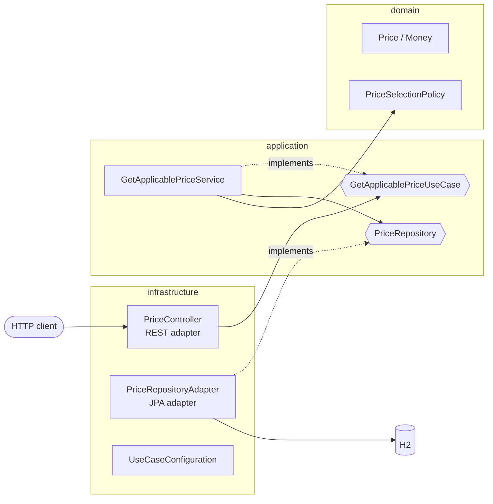

# Prices API

A Spring Boot REST service that tells you which price applies to a product of a brand at a given date.

Price lists overlap in time. When more than one applies, the one with the highest `priority` wins. The service stores the sample dataset in an in-memory H2 database and exposes a single query endpoint.

[](../../actions/workflows/ci.yml)

## Tech stack

| Concern         | Choice                                         |
|-----------------|------------------------------------------------|
| Language        | Java 21 (records, `var`, text blocks)          |
| Framework       | Spring Boot 3.5 (Web, Validation, Data JPA)    |
| Database        | H2 in-memory, initialised from SQL scripts     |
| API docs        | springdoc-openapi (Swagger UI)                 |
| Errors          | RFC 9457 Problem Details                       |
| Testing         | JUnit 5, AssertJ, Mockito, MockMvc, ArchUnit   |
| Build / CI      | Maven, GitHub Actions                          |

## Quick start

Requirements: JDK 21 and Maven 3.9+ (or the Maven wrapper, if present).

```bash
mvn spring-boot:run
```

Then query the endpoint:

```bash
curl "http://localhost:8080/api/v1/prices?applicationDate=2020-06-14T16:00:00&productId=35455&brandId=1"
```

```json
{
  "productId": 35455,
  "brandId": 1,
  "priceList": 2,
  "startDate": "2020-06-14T15:00:00",
  "endDate": "2020-06-14T18:30:00",
  "price": 25.45,
  "currency": "EUR"
}
```

Other useful URLs while the app is running:

- Swagger UI: http://localhost:8080/swagger-ui.html
- OpenAPI spec: http://localhost:8080/v3/api-docs
- H2 console: http://localhost:8080/h2-console (JDBC URL `jdbc:h2:mem:pricesdb`, user `sa`, no password)

## API

### `GET /api/v1/prices`

| Query parameter   | Type                               | Required | Example               |
|-------------------|------------------------------------|----------|-----------------------|
| `applicationDate` | ISO-8601 local date-time           | yes      | `2020-06-14T10:00:00` |
| `productId`       | positive integer                   | yes      | `35455`               |
| `brandId`         | positive integer                   | yes      | `1`                   |

| Status | Meaning                                                               |
|--------|-----------------------------------------------------------------------|
| `200`  | Applicable price found (body shown above)                             |
| `400`  | Missing, malformed or non-positive parameter (`application/problem+json`) |
| `404`  | No price applies to that product/brand at that date (`application/problem+json`) |

Example error:

```json
{
  "type": "about:blank",
  "title": "Price not found",
  "status": 404,
  "detail": "No applicable price found for brandId=1, productId=35455 at 2019-01-01T00:00",
  "instance": "/api/v1/prices"
}
```

## Architecture

The code follows **hexagonal architecture (ports and adapters)**. It has three layers, and dependencies only point inwards.



```
src/main/java/dev/alexmunoz/prices
├── domain                      # Pure Java: no framework dependencies
│   ├── model                   # Price (aggregate); Money, BrandId, ProductId (value objects)
│   ├── service                 # PriceSelectionPolicy (business rule)
│   └── exception               # PriceNotFoundException
├── application                 # Pure Java: orchestrates the domain
│   ├── port/in                 # GetApplicablePriceUseCase + query (inbound port)
│   ├── port/out                # PriceRepository (outbound port)
│   └── service                 # GetApplicablePriceService
└── infrastructure              # Spring-dependent adapters
    ├── adapter/in/rest         # Controller, response DTO, error handling
    ├── adapter/out/persistence # JPA entity, Spring Data repository, adapter, mapper
    └── config                  # Bean wiring for the domain/application classes
```

Key points:

- **The domain and application layers are framework-free.** They have no Spring or JPA annotations. `UseCaseConfiguration` in the infrastructure layer registers them as beans. The JPA entity is a separate class from the domain `Price`, and a mapper converts between them.
- **ArchUnit tests enforce the boundaries** (`HexagonalArchitectureTest`), so a dependency that breaks the architecture fails the build.
- **Package-private adapters.** The controller, JPA adapter, Spring Data repository and mappers are package-private, so other packages can only reach them through their ports.

## Price selection algorithm

The rule lives in `PriceSelectionPolicy` and is written with the Streams API:

```java
return candidates.stream()
        .filter(Objects::nonNull)
        .filter(price -> price.isApplicableAt(applicationDate))
        .max(comparingInt(Price::priority)
                .thenComparing(Price::startDate)
                .thenComparingInt(Price::priceList));
```

1. Only prices whose validity period contains the application date are kept. **Both bounds are inclusive.**
2. The highest `priority` wins.
3. The specification doesn't cover ties on priority. In that case the price that started most recently wins, then the higher price list, so the result never depends on the order the rows come back in.

The repository does the coarse filtering in SQL (brand, product and date range, backed by a composite index). The domain policy makes the final choice. That keeps the business rule in the domain, where it's unit-tested without a database.

## Data model

`src/main/resources/schema.sql` and `data.sql` create and populate the `PRICES` table. The columns follow the specification. There's also a surrogate `ID`, the `LAST_UPDATE` / `LAST_UPDATE_BY` audit columns from the sample dataset, a `CHECK (END_DATE >= START_DATE)` constraint, and an index on `(BRAND_ID, PRODUCT_ID, START_DATE, END_DATE)`.

| BRAND_ID | START_DATE          | END_DATE            | PRICE_LIST | PRODUCT_ID | PRIORITY | PRICE | CURR |
|----------|---------------------|---------------------|------------|------------|----------|-------|------|
| 1        | 2020-06-14 00:00:00 | 2020-12-31 23:59:59 | 1          | 35455      | 0        | 35.50 | EUR  |
| 1        | 2020-06-14 15:00:00 | 2020-06-14 18:30:00 | 2          | 35455      | 1        | 25.45 | EUR  |
| 1        | 2020-06-15 00:00:00 | 2020-06-15 11:00:00 | 3          | 35455      | 1        | 30.50 | EUR  |
| 1        | 2020-06-15 16:00:00 | 2020-12-31 23:59:59 | 4          | 35455      | 1        | 38.95 | EUR  |

## Testing

```bash
mvn verify
```

| Test class                        | Layer          | What it covers                                                   |
|-----------------------------------|----------------|------------------------------------------------------------------|
| `PriceTest`, `MoneyTest`, `IdentifierTest` | Domain | Invariants, identifiers and inclusive validity bounds    |
| `PriceSelectionPolicyTest`        | Domain         | The stream algorithm: priority, ties, ordering, empty/null input |
| `GetApplicablePriceServiceTest`   | Application    | Use case orchestration with a mocked repository port             |
| `PriceRepositoryAdapterTest`      | Infrastructure | JPA query and entity-to-domain mapping on H2 (`@DataJpaTest`)    |
| `PriceControllerTest`             | Infrastructure | HTTP contract, validation and error mapping (`@WebMvcTest`)      |
| `PricesApiAcceptanceTest`         | End to end     | The five required scenarios through the full stack               |
| `HexagonalArchitectureTest`       | Architecture   | Layer dependency rules (ArchUnit)                                |

Required scenarios (product `35455`, brand `1`):

| Test | Application date    | Expected price list | Expected price |
|------|---------------------|---------------------|----------------|
| 1    | 2020-06-14 10:00    | 1                   | 35.50 EUR      |
| 2    | 2020-06-14 16:00    | 2                   | 25.45 EUR      |
| 3    | 2020-06-14 21:00    | 1                   | 35.50 EUR      |
| 4    | 2020-06-15 10:00    | 3                   | 30.50 EUR      |
| 5    | 2020-06-16 21:00    | 4                   | 38.95 EUR      |

## Design decisions and trade-offs

- **`LocalDateTime` rather than a zoned type.** The source data has no time zone, so the API takes and returns local date-times. A multi-region deployment would move to `OffsetDateTime` or `Instant`, with the zone stored alongside each price.
- **Inclusive end date.** This matches the sample data (`23:59:59`). A half-open interval `[start, end)` would handle sub-second requests at the boundary more cleanly. That would change the data contract, though, so it was left as specified.
- **`GET` with query parameters.** The operation is a safe, idempotent, cacheable read.
- **URI versioning (`/api/v1`)** keeps room for future changes to the contract.
- **SQL scripts rather than Hibernate DDL** (`ddl-auto: none`). The schema is explicit and reviewable. In production it would move to a migration tool such as Flyway.

## AI-assisted development

This project was built with an AI coding assistant (Claude) as a pair programmer. The AI helped scaffold the hexagonal structure, draft tests and write this README. Every change was reviewed, adjusted and committed by the author.

## Commit convention

The history follows [Conventional Commits](https://www.conventionalcommits.org) (`feat`, `fix`, `test`, `docs`, `build`, `ci`, `chore`), with scopes for the architecture layers (`domain`, `application`, `infrastructure`, `architecture`).
